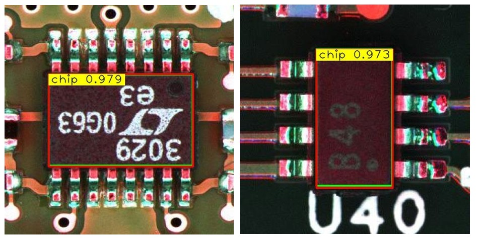

# 🚀 EfficientNetv2-L + YOLOv4 for Integrated Circuit Detection on PCBs

> 🔒 **Note**: This repository serves as a research project summary and does **not include source code or dataset** due to data confidentiality agreements. The baseline implementations referenced for this work are as follows:

> - **YOLOv4 original implementation**: [AlexeyAB/darknet](https://github.com/AlexeyAB/darknet)  
> - **EfficientNetv2 official source** (Keras team): [`keras.applications.efficientnet_v2`](https://github.com/keras-team/keras/blob/6adc2bf7d8d548f92667f8337d27be6b1674ddf5/keras/src/applications/efficientnet_v2.py)  
> - **EfficientNet-YOLOv4 baseline** (Keras-based pipeline): [david8862/keras-YOLOv3-model-set](https://github.com/david8862/keras-YOLOv3-model-set)  

---

## 📘 Overview

This project was conducted as part of a master's research collaboration with PCB manufacturing company. The objective was to enhance object detection performance in printed circuit board (PCB) inspection tasks, focusing specifically on the accurate localization of integrated circuit (IC) components.

By replacing the original YOLOv4 backbone with **EfficientNetv2-L** and performing systematic architecture and hyperparameter tuning, the model achieved significantly improved detection accuracy and robustness under complex visual conditions.

---

## 🎯 Objectives

- Integrate **EfficientNetv2-L** as the YOLOv4 backbone to improve feature extraction efficiency.
- Test anchor box settings for PCB datasets with small-scale objects.
- Experiment with various loss functions, including **CIoU** and **SIoU**.
- Evaluate the impact of **Bag of Freebies (BoF)** techniques on detection performance.

---

## 🖼️ Dataset Description

- 26,775 annotated PCB images from real manufacturing data.
- IC components vary in size, color, orientation, and texture.
- Dataset includes both original and augmented images (flipping, hue, mosaic, etc.).
- *Dataset provided under NDA and is not publicly shareable.*
- Open-source PCB image is use for testing :  15 images were sourced from Fazle's (2021) open-source computer vision dataset hosted on Roboflow: AiBodyAndPin_001 dataset. Roboflow. https://universe.roboflow.com/fazle/aibodyandpin_001 
---

## ⚙️ Methodology

### 🔧 Architecture Design

- **Backbone**: EfficientNetv2-L  
- **Neck**: PANet + modified FPN  
- **Head**: YOLOv4 detection layers  

### 🧪 Training Configuration

- Image input size: 416 × 416  
- Optimizer: SGD with warm-up and cosine learning rate decay  
- Batch size: 64  
- Augmentations: Mosaic, random flip, hue shift  
- Loss functions tested: CIoU, SIoU  
- Anchor strategies: YOLOv3 default vs. pcban - anchors size listed from other research paper:  (13,31, 21,42, 31,15, 34,58, 51,29, 57,98, 78,48, 150,118, 255,323)
- BoF techniques: DropBlock, data augmentation, regularization

---

## 🧬 Experimental Settings
**Backbone Comparison**
| Backbone Configuration  | Variation  |
|-------------------------|------------|
| EfficientNetv1          |     B0     | 
| EfficientNetv1          |     B1     | 
| EfficientNetv1          |     B7     | 
| EfficientNetv2          |     S      |  
| EfficientNetv2          |     M      | 
| EfficientNetv2          |     L      | 

**Experiment on Anchor Size, Loss Function and BoF Configurations**
| Configuration       | Backbone         | Anchors        | Loss Function  | BoF Applied  |  
|---------------------|------------------|----------------|----------------|--------------|  
| L-ciou-y3           | EfficientNetv2-L | YOLOv3 default | CIoU           | No           |  
| L-ciou-pcban        | EfficientNetv2-L | PCB-optimized  | CIoU           | No           |
| L-siou-y3           | EfficientNetv2-L | YOLOv3 default | SIoU           | No           | 
| L-siou-pcban        | EfficientNetv2-L | PCB-optimized  | SIoU           | No           |
| L-ciou-y3-BoF       | EfficientNetv2-L | YOLOv3 default | CIoU           | Yes          | 
| L-ciou-pcban-BoF    | EfficientNetv2-L | PCB-optimized  | CIoU           | Yes          | 
| L-siou-y3-BoF       | EfficientNetv2-L | YOLOv3 default | SIoU           | Yes          | 
| L-siou-pcban-BoF    | EfficientNetv2-L | PCB-optimized  | SIoU           | Yes          |  

---

## 📊 Results Summary

Example of Predicted Results

---

## 🧠 Key Takeaways

- EfficientNetv2-L significantly improves performance over YOLOv4's default backbone in PCB inspection tasks.
- BoF techniques can further boost detection effectiveness without increasing model size.

---

## 🔭 Future Work

- Implement YOLOv7
---

## ✍️ Citation

If you're interested in the full research paper, you can refer to:

> T. S. Chi et al., "Enhancing EfficientNet-YOLOv4 for Integrated Circuit Detection on Printed Circuit Board (PCB)," in IEEE Access, vol. 12, pp. 25066-25078, 2024, doi: 10.1109/ACCESS.2024.3359639. keywords: {Inspection;YOLO;Integrated circuits;Detectors;Feature extraction;Training;Electronic components;Automated visual inspection;feature extraction network;object detection;printed circuit board (PCB)}
https://ieeexplore.ieee.org/abstract/document/10416864
---
## 📖 References

> A. Bochkovskiy, C.-Y. Wang, and H.-Y. M. Liao, “Yolov4: Optimal speed and accuracy of object detection”, arXiv preprintarXiv:2004.10934, Apr. 2020, Accessed: Feb. 17, 2022. [Online]. Available: https://github.com/AlexeyAB/darknet.
> M. Tan and Q. V. Le, “Efficientnetv2: Smaller models and faster training”, In International conference on machine learning, vol. 139, pp. 10096–10106, Apr. 2021, Accessed: Jul. 26, 2023. [Online]. Available: https://arxiv.org/abs/2104.00298v3
> Z. Gevorgyan, “SIoU loss: More powerful learning for bounding box regression”, arXiv preprint arXiv:2205.12740, May 2022, Accessed:Aug 2023. https://arxiv.org/abs/2205.12740v1
> J. Li, J. Gu, Z. Huang, and J. Wen, “Application research of improved YOLO V3 algorithm in PCB electronic component detection”, Applied Sciences (Switzerland), vol. 9, no. 18, p. 3750, 2019, doi: 10.3390/app9183750. 
